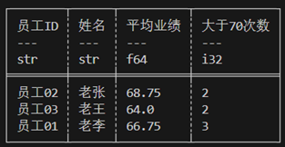

# 分组和简单聚合

LazyFrame经过精心设计，更便于使用：建议调用dataframe.lazy()转换为LazyFrame后再进行聚合。

术语|含义
--|--
简单聚合|输入若干数据，根据某种算法返回一个值。例如：min，max，mean,head,tail等等都属于聚合函数。
分组|顾名思义，将数据根据指定字段进行分组，后续的聚合操作将对每个组调用一次聚合函数。

## 实战1

观察示例数据employee_df，其中保存了3位员工近4个月的业绩。

```rust
let mut employee_df: DataFrame = df!("姓名"=> ["老李", "老李", "老李", "老李", "老张", "老张", "老张", "老张", "老王", "老王", "老王", "老王"],
"员工ID"=> ["员工01", "员工01", "员工01", "员工01", "员工02", "员工02", "员工02", "员工02", "员工03", "员工03", "员工03", "员工03"],
"日期"=> ["8月", "9月", "10月", "11月", "8月", "9月", "10月", "11月", "8月", "9月", "10月", "11月"],
"业绩"=> [83, 24, 86, 74, 89, 59, 48, 79, 51, 71, 44, 90])?;
```

现在的需求是计算每个人所有月份业绩平均值，并且计算出每个人业绩大于70的次数。数据需要根据`员工ID`进行分组然后聚合。

```rust
   let res = employee_df.lazy().group_by(["员工ID","姓名"]) //group_by执行后可能会打乱行序，group_by_stable可以保留原行序。
            .agg([
                col("业绩").mean().alias("平均业绩"),
                col("业绩").gt(70).cast(DataType::Int32).sum().alias("大于70次数")
            ]).collect()?;
        
    println!("{}",res);
```

polars通过表达式提供的聚合函数能完成简单聚合。


## 实战2

计算每个月份获得业务第一名，第二名的人及其对应业绩。

```rust
    let res = employee_df.lazy().group_by(["日期"]) //group_by执行后可能会打乱行序，group_by_stable可以保留原行序。
    .agg([
        col("员工ID"),
        col("业绩"),
        col("业绩").rank(RankOptions::default(),None).alias("rank"),
    ]) //step 1
    .explode([col("员工ID"),col("业绩"),col("rank")]) //step2
    .filter(col("rank").gt_eq(2))  //step3
    .collect()?
    ;
```

### Step1

```rust
.group_by(["日期"]).agg([
        col("员工ID"),
        col("业绩"),
        col("业绩").rank(RankOptions::default(),None).alias("rank"),
    ])
```
实战2中调用的agg聚合操作将组内的多个结果包裹进一个list。

```bash
shape: (4, 4)
┌──────┬────────────────────────────────┬──────────────┬───────────┐
│ 日期 │ 员工ID                         ┆ 业绩          ┆ rank      │
│ ---  ┆ ---                            ┆ ---          ┆ ---       │
│ str  ┆ list[str]                      ┆ list[i32]    ┆ list[u32] │
╞══════╪════════════════════════════════╪══════════════╪═══════════╡
│ 10月 ┆ ["员工01", "员工02", "员工03"]  ┆ [86, 48, 44] ┆ [3, 2, 1] │
│ 8月  ┆ ["员工01", "员工02", "员工03"]  ┆ [83, 89, 51] ┆ [2, 3, 1] │
│ 11月 ┆ ["员工01", "员工02", "员工03"]  ┆ [74, 79, 90] ┆ [1, 2, 3] │
│ 9月  ┆ ["员工01", "员工02", "员工03"]  ┆ [24, 59, 71] ┆ [1, 2, 3] │
└──────┴────────────────────────────────┴──────────────┴───────────┘
```

### step2

`.explode([col("员工ID"),col("业绩"),col("rank")])`
该调用将被list包裹的值解包。

```rust
shape: (12, 4)
┌──────┬────────┬──────┬──────┐
│ 日期 ┆ 员工ID ┆ 业绩 ┆ rank │
│ ---  ┆ ---    ┆ ---  ┆ ---  │
│ str  ┆ str    ┆ i32  ┆ u32  │
╞══════╪════════╪══════╪══════╡
│ 8月  ┆ 员工01 ┆ 83   ┆ 2    │
│ 8月  ┆ 员工02 ┆ 89   ┆ 3    │
│ 8月  ┆ 员工03 ┆ 51   ┆ 1    │
│ 10月 ┆ 员工01 ┆ 86   ┆ 3    │
│ 10月 ┆ 员工02 ┆ 48   ┆ 2    │
│ …    ┆ …      ┆ …    ┆ …    │
│ 11月 ┆ 员工02 ┆ 79   ┆ 2    │
│ 11月 ┆ 员工03 ┆ 90   ┆ 3    │
│ 9月  ┆ 员工01 ┆ 24   ┆ 1    │
│ 9月  ┆ 员工02 ┆ 59   ┆ 2    │
│ 9月  ┆ 员工03 ┆ 71   ┆ 3    │
└──────┴────────┴──────┴──────┘
```