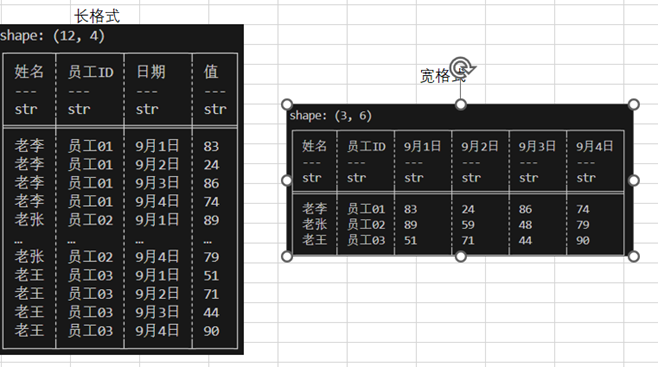

# 数据透视Pivots
数据透视Pivots
数据透视是将数据进行长格式转换为宽格式，并应用聚合函数。

```rust
//cargo.toml polars features中添加"pivot"。
use polars_lazy::frame::pivot::pivot;
    let out = pivot(&df1, ["日期"], Some(["姓名","员工ID"]), Some(["值"]), false, None, None)?;
    println!("{}\n{}",df1,out);

```

