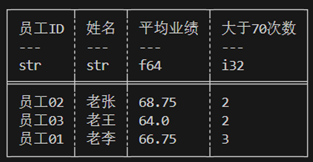

# Lazyframe分组和聚合

Lazyframe的表达式经过精心设计通常情况下建议优先使用LazyFrame的分组和聚合API。

术语|含义
--|--
简单聚合|输入若干数据，根据某种算法返回一个值。例如：min，max，mean,head,tail等等都属于聚合函数。
分组|顾名思义，将数据根据指定字段进行分组，后续的聚合操作将对每个组调用一次聚合函数。

## 实战1

观察示例数据employee_df，其中保存了3位员工近4个月的业绩。

```rust
let mut employee_df: DataFrame = df!("姓名"=> ["老李", "老李", "老李", "老李", "老张", "老张", "老张", "老张", "老王", "老王", "老王", "老王"],
"员工ID"=> ["员工01", "员工01", "员工01", "员工01", "员工02", "员工02", "员工02", "员工02", "员工03", "员工03", "员工03", "员工03"],
"日期"=> ["8月", "9月", "10月", "11月", "8月", "9月", "10月", "11月", "8月", "9月", "10月", "11月"],
"业绩"=> [83, 24, 86, 74, 89, 59, 48, 79, 51, 71, 44, 90])?;
```

现在的需求是计算每个人所有月份业绩平均值，并且计算出每个人业绩大于70的次数。数据需要根据`员工ID`进行分组然后聚合。

```rust
   let res = employee_df.lazy().group_by(["员工ID","姓名"]) //group_by执行后可能会打乱行序，group_by_stable可以保留原行序。
            .agg([
                col("业绩").mean().alias("平均业绩"),
                col("业绩").gt(70).cast(DataType::Int32).sum().alias("大于70次数")
            ]).collect()?;
        
    println!("{}",res);
```

polars通过表达式提供的聚合函数能完成简单聚合。


## 实战2

计算每个月份获得业务第一名，第二名的人及其对应业绩。

```rust
let step1 = employee_df.lazy().group_by(["Date"]) //group_by may disrupt row order, group_by_stable can preserve the original row order.
.agg([
    col("Employee ID"),
    col("Performance"),
    col("Performance").rank(RankOptions::default(),None).alias("rank"),
]);
let step2 =step1.clone()
    .explode([col("Employee ID"),col("Performance"),col("rank")]);
let step3 =step2.clone() 
    .filter(col("rank").gt_eq(2)) ;
       
println!("step1:{}\nstep2:{}\nstep3:{}",step1.collect()?,step2.collect()?,step3.collect()?);
```

### Step1

```term
step1:shape: (4, 4)
┌───────────┬─────────────────────────────────┬──────────────┬───────────┐
│ Date      ┆ Employee ID                     ┆ Performance  ┆ rank      │
│ ---       ┆ ---                             ┆ ---          ┆ ---       │
│ str       ┆ list[str]                       ┆ list[i32]    ┆ list[u32] │
╞═══════════╪═════════════════════════════════╪══════════════╪═══════════╡
│ August    ┆ ["Employee01", "Employee02", "… ┆ [83, 89, 51] ┆ [2, 3, 1] │
│ October   ┆ ["Employee01", "Employee02", "… ┆ [86, 48, 44] ┆ [3, 2, 1] │
│ November  ┆ ["Employee01", "Employee02", "… ┆ [74, 79, 90] ┆ [1, 2, 3] │
│ September ┆ ["Employee01", "Employee02", "… ┆ [24, 59, 71] ┆ [1, 2, 3] │
└───────────┴─────────────────────────────────┴──────────────┴───────────┘
```

### step2

```term
step2:shape: (12, 4)
┌───────────┬─────────────┬─────────────┬──────┐
│ Date      ┆ Employee ID ┆ Performance ┆ rank │
│ ---       ┆ ---         ┆ ---         ┆ ---  │
│ str       ┆ str         ┆ i32         ┆ u32  │
╞═══════════╪═════════════╪═════════════╪══════╡
│ November  ┆ Employee01  ┆ 74          ┆ 1    │
│ November  ┆ Employee02  ┆ 79          ┆ 2    │
│ November  ┆ Employee03  ┆ 90          ┆ 3    │
│ October   ┆ Employee01  ┆ 86          ┆ 3    │
│ October   ┆ Employee02  ┆ 48          ┆ 2    │
│ …         ┆ …           ┆ …           ┆ …    │
│ September ┆ Employee02  ┆ 59          ┆ 2    │
│ September ┆ Employee03  ┆ 71          ┆ 3    │
│ August    ┆ Employee01  ┆ 83          ┆ 2    │
│ August    ┆ Employee02  ┆ 89          ┆ 3    │
│ August    ┆ Employee03  ┆ 51          ┆ 1    │
└───────────┴─────────────┴─────────────┴──────┘
```

### step3

```term
step3:shape: (8, 4)
┌───────────┬─────────────┬─────────────┬──────┐
│ Date      ┆ Employee ID ┆ Performance ┆ rank │
│ ---       ┆ ---         ┆ ---         ┆ ---  │
│ str       ┆ str         ┆ i32         ┆ u32  │
╞═══════════╪═════════════╪═════════════╪══════╡
│ November  ┆ Employee02  ┆ 79          ┆ 2    │
│ November  ┆ Employee03  ┆ 90          ┆ 3    │
│ August    ┆ Employee01  ┆ 83          ┆ 2    │
│ August    ┆ Employee02  ┆ 89          ┆ 3    │
│ October   ┆ Employee01  ┆ 86          ┆ 3    │
│ October   ┆ Employee02  ┆ 48          ┆ 2    │
│ September ┆ Employee02  ┆ 59          ┆ 2    │
│ September ┆ Employee03  ┆ 71          ┆ 3    │
└───────────┴─────────────┴─────────────┴──────┘
```

## 复杂聚合和自定义函数

- 简单聚合：输入单个Series，输出只有一个元素的Series。
- 复杂聚合：输入多个Series，输出多行和多列。

复杂聚合需要自定义函数计算出我们想要的结果。

在`lazy().group_by/agg`表达式上下文中，使用col("score").apply_many

```rust
use polars::prelude::*;
let mut employee_df: DataFrame = df!("Name"=> ["Lao Li", "Lao Li", "Lao Li", "Lao Li", "Lao Zhang", "Lao Zhang", "Lao Zhang", "Lao Zhang", "Lao Wang", "Lao Wang", "Lao Wang", "Lao Wang"],
"Employee ID"=> ["Employee01", "Employee01", "Employee01", "Employee01", "Employee02", "Employee02", "Employee02", "Employee02", "Employee03", "Employee03", "Employee03", "Employee03"],
"Date"=> ["August", "September", "October", "November", "August", "September", "October", "November", "August", "September", "October", "November"],
"Performance"=> [83, 24, 86, 74, 89, 59, 48, 79, 51, 71, 44, 90])?;

let user_defined_function= |x: & mut[Series]| -> Result<Option<Series>, PolarsError>{
    let arg0 = &x[0];
    let arg1 = &x[1];
    let arg2 = &x[2];
    // 完成分析，我们获得了以下结果
    let res_field1 = Series::new("rank".into(), vec!["field1,row[10]","row[11]","row[12]"]);
    let res_field2 = Series::new("rank2".into(), vec!["field2,row[20]","row[21]","row[22]"]);
    let res_field3 = Series::new("rank3".into(), vec![1,2,3]);
    //For each group, 我们可以返回复杂的二维结构 
    //而在简单聚合里，结果只能是单个值.
    //复杂的二维结构必须被StructChunked包裹起来，这样就能保存入单个Series
    //对于每个组，我们必须保持StructChunked 的"Schema"保持不变,
    //"Schema" 指的是StructChunked 字段的顺序、名称、数据类型。
    let res=StructChunked::from_series("res".into(), &[res_field1,res_field2,res_field3])?.into_series();
    Ok(Some(res))
};

// let sc = DataType::Struct(vec![
    // Field::new("f1".into(), DataType::String),
    // Field::new("f2".into(), DataType::String),
    // Field::new("f3".into(), DataType::Int32 )
// ]);

//In the API文档, `GetOutput::from_type(DataType::Boolean)` 应该是 `GetOutput::from_type(sc)`. 但事实上任意的`GetOutput`都能工作.
let output_type = GetOutput::from_type(DataType::Boolean);
let res = employee_df.lazy().group_by([col("Date")]).agg(
[
    //col("date"),
    col("Performance").apply_many(user_defined_function, &[col("Name"),col("Employee ID"),col("Performance")], output_type)
]
).collect()?;
    // expolde,unnest 用于解包StructChunked
println!("{}",res.explode(["Performance"])?.unnest(["Performance"])?);
```

.expolde, .unnest 用于解包List和StructChunked，见 [字符串分割到多行](表达式-字符串操作.md#字符串分割到多行), [字符串分割到多列](表达式-字符串操作.md#分割到多列)

Output:

```bash
        shape: (12, 4)
    ┌──────┬────────────────┬────────────────┬───────┐
    │ date ┆ rank           ┆ rank2          ┆ rank3 │
    │ ---  ┆ ---            ┆ ---            ┆ ---   │
    │ str  ┆ str            ┆ str            ┆ i32   │
    ╞══════╪════════════════╪════════════════╪═══════╡
    │ 10月 ┆ field1,row[10] ┆ field2,row[20] ┆ 1     │
    │ 10月 ┆ row[11]        ┆ row[21]        ┆ 2     │
    │ 10月 ┆ row[12]        ┆ row[22]        ┆ 3     │
    │ 8月  ┆ field1,row[10] ┆ field2,row[20] ┆ 1     │
    │ 8月  ┆ row[11]        ┆ row[21]        ┆ 2     │
    │ …    ┆ …              ┆ …              ┆ …     │
    │ 11月 ┆ row[11]        ┆ row[21]        ┆ 2     │
    │ 11月 ┆ row[12]        ┆ row[22]        ┆ 3     │
    │ 9月  ┆ field1,row[10] ┆ field2,row[20] ┆ 1     │
    │ 9月  ┆ row[11]        ┆ row[21]        ┆ 2     │
    │ 9月  ┆ row[12]        ┆ row[22]        ┆ 3     │
    └──────┴────────────────┴────────────────┴───────┘
```
