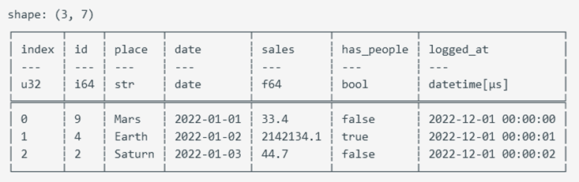

# 列选择

在select上下文中，可以使用col()表达式选择某些列。
col("*")或all() 表示选中所有列。exclude(["logged_at", "index"])表示排除指定列。*可用于通配符。
cols(["date", "logged_at"])，选中指定的names。

```rust
//单列选择
let out = df.clone().lazy().select([col("place")]).collect()?;

//通配符选取，选中列名以a开始的所有列
let out = df.clone().lazy().select([col("a*")]).collect()?;

//正则表达式
let out = df.clone().lazy().select([col("^.*(as|sa).*$")]).collect()?;

//多个列名选取
let out = df.clone().lazy().select([cols(["date", "logged_at"])]).collect()?;
//数据类型选取,选择满足数据类型的所有列。
let out = df.clone().lazy()
    .select([dtype_cols([DataType::Int64, DataType::UInt32, DataType::Boolean]).n_unique()])
.collect()?;

```
本节数据集生成
```rust
use chrono::prelude::*;
use polars::time::*;

let date_df = df!(
    "id" => &[9, 4, 2],
    "place" => &["Mars", "Earth", "Saturn"],
    "date" => date_range("date",
NaiveDate::from_ymd_opt(2022, 1, 1).unwrap().and_hms_opt(0, 0, 0).unwrap(),
NaiveDate::from_ymd_opt(2022, 1, 3).unwrap().and_hms_opt(0, 0, 0).unwrap(),
Duration::parse("1d"),ClosedWindow::Both, TimeUnit::Milliseconds, None)?,
    "sales" => &[33.4, 2142134.1, 44.7],
    "has_people" => &[false, true, false],
    "logged_at" => date_range("logged_at",
    NaiveDate::from_ymd_opt(2022, 1, 1).unwrap().and_hms_opt(0, 0, 0).unwrap(), NaiveDate::from_ymd_opt(2022, 1, 1).unwrap().and_hms_opt(0, 0, 2).unwrap(), Duration::parse("1s"),ClosedWindow::Both, TimeUnit::Milliseconds, None)?,
    )?
    .with_row_index("index", None)?;
println!("{}", &df);
```



